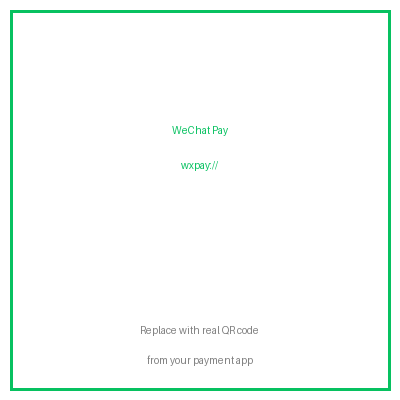
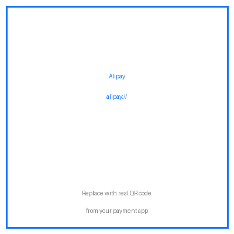

# Claude Code Token 优化完全指南

> 在开始编码之前，先砍掉 39% 的 token 账单。真实数据，真实配置，不废话。

<p align="center">
  
</p>

## 你正在悄悄支付"隐形税"

每个 Claude Code session 启动时，在你输入任何内容之前，就已经消耗了 **~24,000 tokens**——系统提示、skill 描述、MCP 工具 schema、CLAUDE.md 文件、记忆注入、hook 输出。每一轮对话都在重复支付这笔开销。

如果你装了 30+ 个 skill、5 个 MCP 服务器、写了几百行 CLAUDE.md，那么约 70% 的 token 是假开销，只有 30% 真正用于你的工作任务。

## 四层防线

```
第一层：固定开销削减
  skillOverrides 分级 │ 规则触发索引 │ autoCompact 提前压缩
  砍掉每一轮对话的"入场费"

第二层：运行时压缩
  squeez hooks │ Bash 输出去重 │ Read/Grep 截断
  工具输出在进入上下文之前就被压缩

第三层：干净输入
  markitdown │ PDF/Office → 整洁 Markdown
  不把原始 PDF 直接喂给 LLM

第四层：安全护栏
  deny 规则 │ bypassPermissions 边界
  全自动执行 + 硬安全边界
```

## 快速开始

完整配置见 [README.md](README.md) 和各层详细说明。

---

## 打赏

<p align="center">
  <b>如果这份指南帮你省了 token，请我喝杯咖啡 ☕</b>
</p>

<p align="center">
  <table>
    <tr>
      <td align="center"><b>微信支付</b></td>
      <td align="center"><b>支付宝</b></td>
    </tr>
    <tr>
      <td align="center">
        <br>
        <sub>微信扫码打赏</sub>
      </td>
      <td align="center">
        <br>
        <sub>支付宝扫码打赏</sub>
      </td>
    </tr>
  </table>
</p>

## 许可证

MIT © 2026
